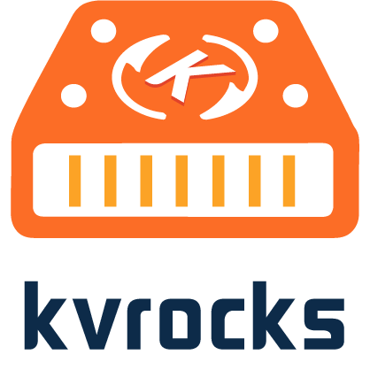
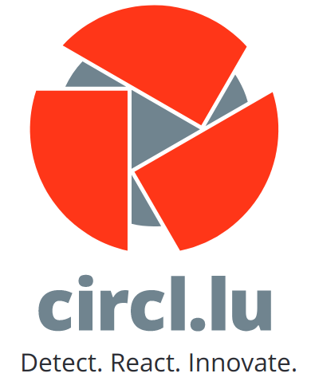
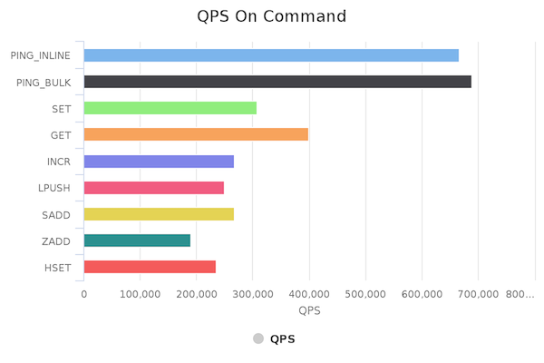
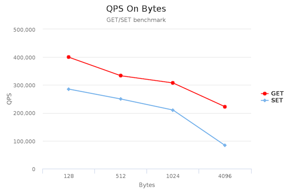

<!--
 Licensed to the Apache Software Foundation (ASF) under one
 or more contributor license agreements.  See the NOTICE file
 distributed with this work for additional information
 regarding copyright ownership.  The ASF licenses this file
 to you under the Apache License, Version 2.0 (the
 "License"); you may not use this file except in compliance
 with the License.  You may obtain a copy of the License at

   http://www.apache.org/licenses/LICENSE-2.0

 Unless required by applicable law or agreed to in writing,
 software distributed under the License is distributed on an
 "AS IS" BASIS, WITHOUT WARRANTIES OR CONDITIONS OF ANY
 KIND, either express or implied.  See the License for the
 specific language governing permissions and limitations
 under the License.
-->



[](https://github.com/apache/incubator-kvrocks/actions/workflows/kvrocks.yaml)
[](https://github.com/apache/incubator-kvrocks/blob/unstable/LICENSE)
[](https://github.com/apache/incubator-kvrocks/stargazers)

---

* [Slack Channel](https://join.slack.com/t/kvrockscommunity/shared_invite/zt-p5928e3r-OUAK8SUgC8GOceGM6dAz6w)
* [Mailing List](https://lists.apache.org/list.html?dev@kvrocks.apache.org) ([how to subscribe](https://www.apache.org/foundation/mailinglists.html#subscribing))

**Apache Kvrocks(Incubating)** is a distributed key value NoSQL database that uses RocksDB as storage engine and is compatible with Redis protocol. Kvrocks intends to decrease the cost of memory and increase the capacity while compared to Redis. The design of replication and storage was inspired by `rocksplicator` and `blackwidow`.

Kvrocks has the following key features:

* Redis protocol, user can use redis client to visit the kvrocks
* Namespace, similar to redis db but use token per namespace
* Replication, async replication using binlog like MySQL
* High Available, supports redis sentinel to failover when master or slave was failed
* Cluster mode, centralized management but compatible with Redis cluster client access

> Thanks for designers @[田凌宇](https://github.com/tianlingyu1997) and @范世丽 contribute the kvrocks logo for us.

## Who uses kvrocks

<table>
<tr>
<td height = "128" width = "164"></td>
<td height = "128" width = "164"></td>
<td height = "128" width = "164"></td>
</tr>
<tr>
<td height = "128" width = "164"></td>
<td height = "128" width = "164"></td>
<td height = "128" width = "164"></td>
</tr>
<tr>
<td height = "128" width = "164"></td>
<td height = "128" width = "164"></td>
<td height = "128" width = "164"></td>
</tr>
</table>

***Tickets a pull request to let us known that you're using kvrocks and add your logo to README***

## Build and Run kvrocks

### Prerequisite

```shell
# CentOS / RedHat
sudo yum install -y epel-release
sudo yum install -y git gcc gcc-c++ make cmake autoconf automake libtool libstdc++-static python3 which openssl-devel

# Ubuntu / Debian
sudo apt update
sudo apt install -y git gcc g++ make cmake autoconf automake libtool python3 libssl-dev

# macOS
brew install autoconf automake libtool cmake openssl

# Please force linking the openssl if still can't find after installing openssl
brew link --force openssl
```

### Build

It is as simple as:

```shell
$ git clone https://github.com/apache/incubator-kvrocks.git
$ cd incubator-kvrocks
$ ./x.py build # `./x.py build -h` to check more options;
               # especially, `./x.py build --ghproxy` will fetch dependencies via ghproxy.com.
```

To build with TLS support, you'll need OpenSSL development libraries (e.g. libssl-dev on Debian/Ubuntu) and run:

```shell
$ ./x.py build -DENABLE_OPENSSL=ON
```

To build with luaJIT instead of lua for better performance, run:

```shell
$ ./x.py build -DUSE_LUAJIT=ON
```

### Running kvrocks

```shell
$ ./build/kvrocks -c kvrocks.conf
```

### Running kvrocks using Docker

```shell
$ docker run -it -p 6666:6666 apache/kvrocks
# or get the nightly image:
$ docker run -it -p 6666:6666 apache/kvrocks:nightly
```

### Connect kvrocks service

```
$ redis-cli -p 6666

127.0.0.1:6666> get a
(nil)
```

### Running test cases

```shell
$ ./x.py build --unittest
$ ./x.py test cpp # run C++ unit tests
$ ./x.py test go # run Golang (unit and integration) test cases
```

### Supported platforms

* Linux distributions
  * CentOS
  * Ubuntu
  * and most other distros
* macOS


##  Namespace

Namespace is used to isolate data between users. Unlike all the Redis databases can be visited by `requirepass`, we use one token per namespace. `requirepass` is regraded as admin token, and only admin token allows to access the namespace command, as well as some commands like `config`, `slaveof`, `bgsave`, etc..

```
# add token
127.0.0.1:6666>  namespace add ns1 my_token
OK

# update token
127.0.0.1:6666> namespace set ns1 new_token
OK

# list namespace
127.0.0.1:6666> namespace get *
1) "ns1"
2) "new_token"
3) "__namespace"
4) "foobared"

# delete namespace
127.0.0.1:6666> namespace del ns1
OK
```

## Cluster

Kvrocks implements a proxyless centralized cluster solution but its accessing method is completely compatible with the Redis cluster client. You can use Redis cluster SDKs to access the kvrocks cluster. More details, please see: [Kvrocks Cluster Introduction](https://kvrocks.apache.org/docs/Cluster/kvrocks-cluster-introduction)

## Documents

Documents are hosted at the [official website](https://kvrocks.apache.org/docs/supported-commands).

* [Supported Commands](https://kvrocks.apache.org/docs/supported-commands)
* [Design Complex Structure on RocksDB](https://kvrocks.apache.org/docs/Design/design-structure-on-rocksdb)
* [Replication Design](https://kvrocks.apache.org/docs/Design/replication)

## Tools

* Export the Kvrocks monitor metrics, please use [kvrocks_exporter](https://github.com/KvrocksLabs/kvrocks_exporter)
* Migrate from redis to kvrocks, use [redis-migrate-tool](https://github.com/vipshop/redis-migrate-tool) which was developed by @vipshop
* Migrate from kvrocks to redis. use `kvrocks2redis` in build dir

## Performance

### Hardware

* CPU: 48 cores Intel(R) Xeon(R) CPU E5-2650 v4 @ 2.20GHz
* Memory: 32 GiB
* NET:  Intel Corporation I350 Gigabit Network Connection
* DISK: 2TB NVMe Intel SSD DC P4600

>  Benchmark Client:  multi-thread redis-benchmark(unstable branch)

### 1. Commands QPS

> kvrocks: workers = 16, benchmark: 8 threads/ 512 conns / 128 payload

latency: 99.9% < 10ms



### 2.  QPS on different payloads

> kvrocks: workers = 16, benchmark: 8 threads/ 512 conns

latency: 99.9% < 10ms



#### 3. QPS on different workers

> kvrocks: workers = 16, benchmark: 8 threads/ 512 conns / 128 payload

latency: 99.9% < 10ms


## License

Kvrocks is under the Apache License Version 2.0. See the [LICENSE](LICENSE) file for details.

## WeChat Official Account (微信公众号)


