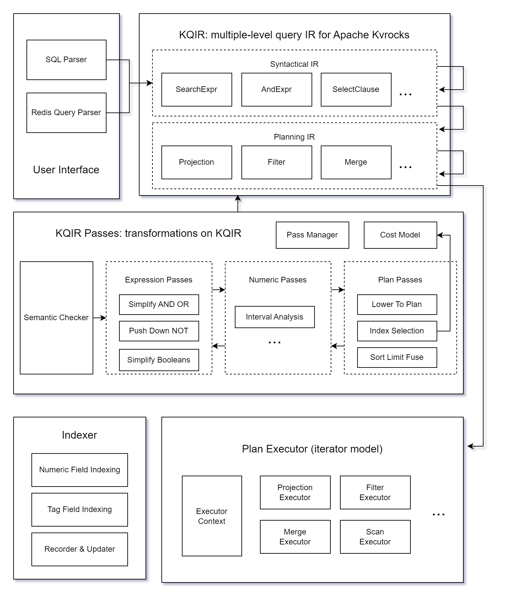

## KQIR: Kvrocks Query Intermediate Representation

Here, *KQIR* refers to both
- the multiple-level *query intermediate representation* for Apache Kvrocks, and
- the *architecture and toolset* for the query optimization and execution.

### Architecture

### Components

- User Interface: both SQL and Redis Query syntax is supported to be the frontend language of KQIR
  - SQL Parser: A parser that accepts an extended subset of MySQL syntax
  - Redis Query Parser: A parser that accepts [Redis query syntax](https://redis.io/docs/latest/develop/interact/search-and-query/advanced-concepts/query_syntax/) (only DIALECT 2 or greater is planned to be supported)
- KQIR: a multiple level query intermediate representation, currently including two levels (syntactical IR and planning IR)
  - Syntactical IR: A high level IR that syntactically represents the query language
  - Planning IR: A low level IR that represents plan operators for query execution
- KQIR passes: analysis and transformation procedures on KQIR
  - Semantic Checker: to check if there is any semantic errors in the IR
  - Expression Passes: passes for query expressions, especially for logical expressions
  - Numeric Passes: passes for numeric & arithmetic properties
  - Plan Passes: passes on the plan operators
  - Pass Manager: to manage the pass execution sequence and order
  - Cost Model: to analyze the cost for the current plan, used by some plan passes
- Plan Executor: a component for query execution via iterator model
- Indexer: to perform the indexing for various types of fields during data changes
